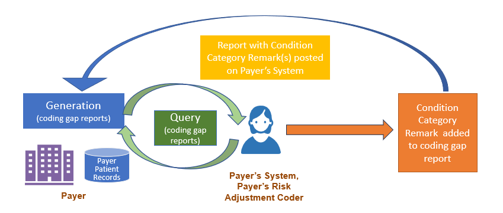
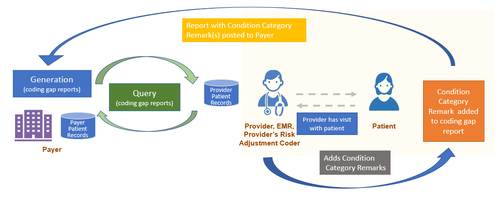
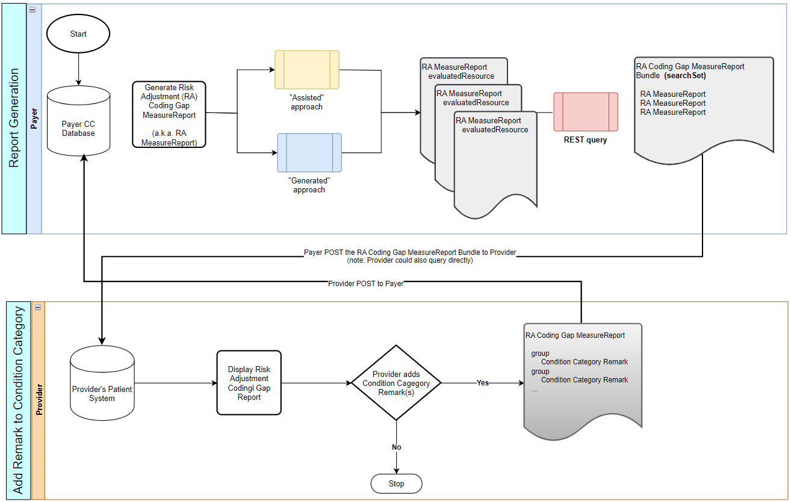

# Add Remark to Condition Category - Da Vinci Risk Adjustment Implementation Guide v3.0.0-ballot

## Add Remark to Condition Category

Once a [Risk Adjustment Coding Gap Report](StructureDefinition-ra-measurereport.md) is generated, a [Condition Category Remark](StructureDefinition-ra-ccRemark.md) can be added to the MeasureReport. Here are some ways this remark may be used:

* added by the Payer or an entity working on behalf of the Payer with additional information about the Condition Category. An example might be adding the qualifying diagnosis codes (`qualifyingDxCode`) when proprietary risk adjustment models are used by the Payer and the mappings between ICD-10 codes and Condition Categories as defined by the models are not readily available to the Provider.
* added by a Risk Adjustment Coder who reviews the chart prior to the Provider seeing the patient. This Coder might be working on behalf of the Payer or the Provider or both.
* added by the provider's Electronic Medical Record (EMR) if a coding gap is not appropriate to be shown to the type of provider seeing the patient or if the EMR cannot process the coding gaps in the Risk Adjustment Coding Gap Report.
* added by the Provider at the time the patient is seen to indicate to the Payer that an action was taken.

Note: The [Condition Category Remark](StructureDefinition-ra-ccRemark.md) extension is not intended to change the status of a Condition Category gap. To change the coding gap status, follow the [Submit Data to Payer](submit-data-to-payer.md) section of this guidance. Note that both a Condition Category remark and [Submit Data to Payer](submit-data-to-payer.md) can be generated at the time the Provider sees the patient if that is appropriate.

### The Condition Category Remark Extension

This [Condition Category Remark](StructureDefinition-ra-ccRemark.md) extension is added to the [Risk Adjustment Coding Gap Report](StructureDefinition-ra-measurereport.md) within the `MeasureReport.group` element. This allows for a remark be added at the Condition Category code level. The Condition Category Remark is a Complex extension and can repeat; it has several elements:

* A remark must have at least an `author`, an `authorOrganization`, or an `authorSoftware` 
* `author` indicates the person who provided the remark. It can be an identifier such as an NPI or a person's name.
* `authorOrganization` which can be an identifier such as a TIN or NPI for the organization or can be a text name of the Organization.
* `authorSoftware` is the software system that generated the remark either an identifier for the system or a system name.
 
* `authorDatetime` when the remark was made
* `text` a free text remark
* `code` a coded remark indicating what happened at the time of the remark. For example, when a provider sees the patient and decides a condition is present, therefore adds a remark using the code `assessed-present`. The value set binding for the `code` is extensible, which includes `assessed-present`, `assessed-not-present`, `in-progress`, `not-assessed`, `not-presented`, `deferred`, and `not-ingested`.
* `reasonCode` coded reason for why remark is added. The value set which is extensible includes `never-had-condition`, `inactive-condition`, and `inapplicable-gap`.
* `relatedDataIentifier` an identifier field that can be used to link to a claim or document such as a Continuity of Care Document (CCD) that the Provider is sending via another method or transaction.
* `qualifyingDxCode` diagnoses that would be classified under this Condition Category as defined by the risk adjustment model. This would be added by the Payer or an entity working on behalf of the Payer.
* `qualifyingDxList`: a list of diagnoses classified under this Condition Category as defined by the risk adjustment model provided as a string. Added by the Payer or an entity working on behalf of the Payer.

The Provider's system being used SHALL NOT change any other part of the original Risk Adjustment Coding Gap Report and can only add the [Condition Category Remark](StructureDefinition-ra-ccRemark.md) to the appropriate `MeasureReport.group`(s). If a provider wants to share data with the Payer in order to change a coding gap status, they should use the [Submit Data to Payer](submit-data-to-payer.md) process.

If a Payer or someone acting on behalf of the Payer like a Risk Adjustment Coder is adding a remark to the report, they would update the report on their server.

**Figure 2.5-1 Payer Adds Remark to Condition Category Overview**


If a Provider, the Provider's EMR, or a Risk Adjustment Coder working on their behalf adds a remark to the Risk Adjustment Coding Gap Report, the [Condition Category Remark](StructureDefinition-ra-ccRemark.md) can be added to the Report with the [PATCH](https://www.hl7.org/fhir/http.html#patch) process or the entire MeasureReport with the added [Condition Category Remark](StructureDefinition-ra-ccRemark.md) extension(s) can be POSTed to the Provider's system.

**Figure 2.5-2 Provider Add Remark to Condition Category Overview**


**Figure 2.5-3 Report Condition Category Remark Workflow when the Provider adds the Remark**


### Provider Handling of the Condition Category Remark

#### POST

The Provider can POST Risk Adjustment Coding Gap Report that includes Condition Category remark(s) with any referenced Resources together as a transaction Bundle.

#### PATCH

In scenarios where PATCH is feasible, for example, no referenced Resources also need to be sent together with the Condition Category remark, the Provider may choose to send the Condition Category remark only to the Payer using a light weight approach rather than sending the entire MeasureReport resource. They can do this using the [PATCH](https://www.hl7.org/fhir/http.html#patch) operation.

A [RA Parameters ccRemark Patch Profile](StructureDefinition-ra-parameters-cc-remark-patch.md) is defined to specify the structures of using the Parameter resource to send the remark using the PATCH operation.

### Payer Handling of the Condition Category Remark

This implementation guide does not direct any action be taken by the Payer upon receipt of a [Risk Adjustment Coding Gap Report](StructureDefinition-ra-measurereport.md) with added Condition Category remark(s).

After a Payer generates a subsequent [Risk Adjustment Coding Gap Report](StructureDefinition-ra-measurereport.md), in their role as Reporting Server they can choose to include the Condition Category remarks as they see fit. This might include adding the remarks only if received from the same Provider and can include any remarks all the way up to including all Condition Category remarks received from any provider. The Payer is not required to include any Condition Category remarks on subsequently generated [Risk Adjustment Coding Gap Report](StructureDefinition-ra-measurereport.md).

### Usage

#### Sending the full MeasureReport with added Remarks to Payer

`PUT [base]/MeasureReport/[id]`

 Click Here to See Example PUT Risk Adjustment Coding Gap Report with Remarks Added 

#### Examples

**Scenario:**

A Provider receives a Risk Adjustment Gaps Report from a Payer. After seeing the patient, Remarks are added to the full report and it is updated at the Payer.

**PUT Risk Adjustment Coding Gaps Report with Remarks**

```
PUT [base]/MeasureReport/ra-measurereport01

```

**Request body**

```
{
    "resourceType": "MeasureReport",
    "id": "ra-measurereport01",
    "meta": {
        "profile": [
            "http://hl7.org/fhir/us/davinci-ra/StructureDefinition/ra-measurereport"
        ]
    },
    "extension": [
        {
            "url": "http://hl7.org/fhir/us/davinci-ra/StructureDefinition/ra-clinicalDataCollectionDeadline",
            "valueDate": "2022-03-31"
        }
    ],
    "status": "complete",
    "type": "individual",
    "measure": "https://build.fhir.org/ig/HL7/davinci-ra/Measure-RAModelExample01",
    "subject": {
        "reference": "Patient/ra-patient01"
    },
    "date": "2021-10-18",
    "reporter": {
        "reference": "Organization/ra-payer01"
    },
    "period": {
        "start": "2021-01-01",
        "end": "2021-09-30"
    },
    "group": [
        {
            "id": "group-001",
            "code": {
                "coding": [
                    {
                        "system": "http://terminology.hl7.org/CodeSystem/cmshcc",
                        "version": "24",
                        "code": "18",
                        "display": "Diabetes with Chronic Complications"
                    }
                ],
                "text": "HCC 18: Diabetes with Chronic Complications"
            },
            "extension": [
                {
                    "url": "http://hl7.org/fhir/us/davinci-ra/StructureDefinition/ra-suspectType",
                    "valueCodeableConcept": {
                        "coding": [
                            {
                                "code": "historic",
                                "system": "http://hl7.org/fhir/us/davinci-ra/CodeSystem/suspect-type"
                            }
                        ]
                    }
                },
                {
                    "url": "http://hl7.org/fhir/us/davinci-ra/StructureDefinition/ra-evidenceStatus",
                    "valueCodeableConcept": {
                        "coding": [
                            {
                                "code": "closed-gap",
                                "system": "http://hl7.org/fhir/us/davinci-ra/CodeSystem/evidence-status"
                            }
                        ]
                    }
                },
                {
                    "url": "http://hl7.org/fhir/us/davinci-ra/StructureDefinition/ra-evidenceStatusDate",
                    "valueDate": "2021-04-01"
                },
                {
                    "url": "http://hl7.org/fhir/us/davinci-ra/StructureDefinition/ra-hierarchicalStatus",
                    "valueCodeableConcept": {
                        "coding": [
                            {
                                "code": "applied-not-superseded",
                                "system": "http://hl7.org/fhir/us/davinci-ra/CodeSystem/hierarchical-status"
                            }
                        ]
                    }
                }
            ]
        },
        {
            "id": "group-002",
            "code": {
                "coding": [
                    {
                        "system": "http://terminology.hl7.org/CodeSystem/cmshcc",
                        "version": "24",
                        "code": "111",
                        "display": "Chronic Obstructive Pulmonary Disease"
                    }
                ],
                "text": "HCC 111: Chronic Obstructive Pulmonary Disease"
            },
            "extension": [
                {
                    "url": "http://hl7.org/fhir/us/davinci-ra/StructureDefinition/ra-suspectType",
                    "valueCodeableConcept": {
                        "coding": [
                            {
                                "code": "historic",
                                "system": "http://hl7.org/fhir/us/davinci-ra/CodeSystem/suspect-type"
                            }
                        ]
                    }
                },
                {
                    "url": "http://hl7.org/fhir/us/davinci-ra/StructureDefinition/ra-evidenceStatus",
                    "valueCodeableConcept": {
                        "coding": [
                            {
                                "code": "pending",
                                "system": "http://hl7.org/fhir/us/davinci-ra/CodeSystem/evidence-status"
                            }
                        ]
                    }
                },
                {
                    "url": "http://hl7.org/fhir/us/davinci-ra/StructureDefinition/ra-evidenceStatusDate",
                    "valueDate": "2021-09-29"
                },
                {
                    "url": "http://hl7.org/fhir/us/davinci-ra/StructureDefinition/ra-hierarchicalStatus",
                    "valueCodeableConcept": {
                        "coding": [
                            {
                                "code": "applied-not-superseded",
                                "system": "http://hl7.org/fhir/us/davinci-ra/CodeSystem/hierarchical-status"
                            }
                        ]
                    }
                }
            ]
        },
        {
            "id": "group-003",
            "code": {
                "coding": [
                    {
                        "system": "http://terminology.hl7.org/CodeSystem/cmshcc",
                        "version": "24",
                        "code": "59",
                        "display": "Major Depressive, Bipolar, and Paranoid Disorders"
                    }
                ],
                "text": "HCC 59: Major Depressive, Bipolar, and Paranoid Disorders"
            },
            "extension": [
                {
                    "url": "http://hl7.org/fhir/us/davinci-ra/StructureDefinition/ra-suspectType",
                    "valueCodeableConcept": {
                        "coding": [
                            {
                                "code": "historic",
                                "system": "http://hl7.org/fhir/us/davinci-ra/CodeSystem/suspect-type"
                            }
                        ]
                    }
                },
                {
                    "url": "http://hl7.org/fhir/us/davinci-ra/StructureDefinition/ra-evidenceStatus",
                    "valueCodeableConcept": {
                        "coding": [
                            {
                                "code": "open-gap",
                                "system": "http://hl7.org/fhir/us/davinci-ra/CodeSystem/evidence-status"
                            }
                        ]
                    }
                },
                {
                    "url": "http://hl7.org/fhir/us/davinci-ra/StructureDefinition/ra-evidenceStatusDate",
                    "valueDate": "2020-07-15"
                },
                {
                    "url": "http://hl7.org/fhir/us/davinci-ra/StructureDefinition/ra-hierarchicalStatus",
                    "valueCodeableConcept": {
                        "coding": [
                            {
                                "code": "applied-not-superseded",
                                "system": "http://hl7.org/fhir/us/davinci-ra/CodeSystem/hierarchical-status"
                            }
                        ]
                    }
                },
                {
                    "url": "http://hl7.org/fhir/us/davinci-ra/StructureDefinition/ra-ccRemark",
                    "extension": [
                        {"url": "author",
                        "valueIdentifier": {
                            "system": "http://hl7.org/fhir/sid/us-npi",
                            "value": "1234567890"
                            }
                        },
                        {"url": "authorDatetime",
                        "valueDateTime": "2021-11-01"
                        },
                        {"url": "text",
                        "valueString": "Diagnosis added"
                        },
                        {"url": "code",
                            "valueCodeableConcept" : {
                                "coding": [
                                    {
                                    "system": "http://hl7.org/fhir/us/davinci-ra/CodeSystem/coding-gap-remark",
                                    "code": "assessed-present",
                                    "display": "Assessed and present"
                                    }
                                ]
                            }
                        },
                        {"url": "relatedDataIdentifier",
                            "valueIdentifier":  {
                                "system": "http://example.org/fhir/myclaimno",
                                "value": "CLM23333"}
                        }
                    ]
                }
            ]
        },
        {
            "id": "group-004",
            "code": {
                "coding": [
                    {
                        "system": "http://terminology.hl7.org/CodeSystem/cmshcc",
                        "version": "24",
                        "code": "112",
                        "display": "Fibrosis of lung and other chronic lung disorders"
                    }
                ],
                "text": "HCC 112: Fibrosis of lung and other chronic lung disorders"
            },
            "extension": [
                {
                    "url": "http://hl7.org/fhir/us/davinci-ra/StructureDefinition/ra-suspectType",
                    "valueCodeableConcept": {
                        "coding": [
                            {
                                "code": "historic",
                                "system": "http://hl7.org/fhir/us/davinci-ra/CodeSystem/suspect-type"
                            }
                        ]
                    }
                },
                {
                    "url": "http://hl7.org/fhir/us/davinci-ra/StructureDefinition/ra-evidenceStatus",
                    "valueCodeableConcept": {
                        "coding": [
                            {
                                "code": "closed-gap",
                                "system": "http://hl7.org/fhir/us/davinci-ra/CodeSystem/evidence-status"
                            }
                        ]
                    }
                },
                {
                    "url": "http://hl7.org/fhir/us/davinci-ra/StructureDefinition/ra-evidenceStatusDate",
                    "valueDate": "2021-04-27"
                },
                {
                    "url": "http://hl7.org/fhir/us/davinci-ra/StructureDefinition/ra-hierarchicalStatus",
                    "valueCodeableConcept": {
                        "coding": [
                            {
                                "code": "applied-superseded",
                                "system": "http://hl7.org/fhir/us/davinci-ra/CodeSystem/hierarchical-status"
                            }
                        ]
                    }
                }
            ]
        },
        {
            "id": "group-005",
            "code": {
                "coding": [
                    {
                        "system": "http://terminology.hl7.org/CodeSystem/cmshcc",
                        "version": "24",
                        "code": "19",
                        "display": "Diabetes without Complications"
                    }
                ],
                "text": "HCC 19: Diabetes without Complications"
            },
            "extension": [
                {
                    "url": "http://hl7.org/fhir/us/davinci-ra/StructureDefinition/ra-suspectType",
                    "valueCodeableConcept": {
                        "coding": [
                            {
                                "code": "historic",
                                "system": "http://hl7.org/fhir/us/davinci-ra/CodeSystem/suspect-type"
                            }
                        ]
                    }
                },
                {
                    "url": "http://hl7.org/fhir/us/davinci-ra/StructureDefinition/ra-evidenceStatus",
                    "valueCodeableConcept": {
                        "coding": [
                            {
                                "code": "pending",
                                "system": "http://hl7.org/fhir/us/davinci-ra/CodeSystem/evidence-status"
                            }
                        ]
                    }
                },
                {
                    "url": "http://hl7.org/fhir/us/davinci-ra/StructureDefinition/ra-evidenceStatusDate",
                    "valueDate": "2021-09-27"
                },
                {
                    "url": "http://hl7.org/fhir/us/davinci-ra/StructureDefinition/ra-hierarchicalStatus",
                    "valueCodeableConcept": {
                        "coding": [
                            {
                                "code": "applied-superseded",
                                "system": "http://hl7.org/fhir/us/davinci-ra/CodeSystem/hierarchical-status"
                            }
                        ]
                    }
                }
            ]
        },
        {
            "id": "group-006",
            "code": {
                "coding": [
                    {
                        "system": "http://terminology.hl7.org/CodeSystem/cmshcc",
                        "version": "24",
                        "code": "84",
                        "display": "Cardio-Respiratory Failure and Shock"
                    }
                ],
                "text": "HCC 84: Cardio-Respiratory Failure and Shock"
            },
            "extension": [
                {
                    "url": "http://hl7.org/fhir/us/davinci-ra/StructureDefinition/ra-suspectType",
                    "valueCodeableConcept": {
                        "coding": [
                            {
                                "code": "historic",
                                "system": "http://hl7.org/fhir/us/davinci-ra/CodeSystem/suspect-type"
                            }
                        ]
                    }
                },
                {
                    "url": "http://hl7.org/fhir/us/davinci-ra/StructureDefinition/ra-evidenceStatus",
                    "valueCodeableConcept": {
                        "coding": [
                            {
                                "code": "open-gap",
                                "system": "http://hl7.org/fhir/us/davinci-ra/CodeSystem/evidence-status"
                            }
                        ]
                    }
                },
                {
                    "url": "http://hl7.org/fhir/us/davinci-ra/StructureDefinition/ra-evidenceStatusDate",
                    "valueDate": "2020-12-15"
                },
                {
                    "url": "http://hl7.org/fhir/us/davinci-ra/StructureDefinition/ra-hierarchicalStatus",
                    "valueCodeableConcept": {
                        "coding": [
                            {
                                "code": "applied-superseded",
                                "system": "http://hl7.org/fhir/us/davinci-ra/CodeSystem/hierarchical-status"
                            }
                        ]
                    }
                },
                {
                    "url": "http://hl7.org/fhir/us/davinci-ra/StructureDefinition/ra-ccRemark",
                    "extension": [
                        {"url": "author",
                            "valueIdentifier": {
                            "system": "http://hl7.org/fhir/sid/us-npi",
                            "value": "1234567890"
                            }
                        },
                        {"url": "authorDatetime",
                        "valueDateTime": "2021-11-01"
                        },
                        {"url": "text",
                        "valueString": "Continue evaluation"
                        },
                        {"url": "code",
                            "valueCodeableConcept" : {
                                "coding": [
                                    {
                                    "system": "http://hl7.org/fhir/us/davinci-ra/CodeSystem/coding-gap-remark",
                                    "code": "deferred",
                                    "display": "Deferred"
                                    }
                                ]
                            }
                        }
                    ]
                }
            ]

        },
        {
            "id": "group-007",
            "code": {
                "coding": [
                    {
                        "system": "http://terminology.hl7.org/CodeSystem/cmshcc",
                        "version": "24",
                        "code": "22",
                        "display": "Morbid Obesity"
                    }
                ],
                "text": "HCC 22: Morbid Obesity"
            },
            "extension": [
                {
                    "url": "http://hl7.org/fhir/us/davinci-ra/StructureDefinition/ra-suspectType",
                    "valueCodeableConcept": {
                        "coding": [
                            {
                                "code": "suspected",
                                "system": "http://hl7.org/fhir/us/davinci-ra/CodeSystem/suspect-type"
                            }
                        ]
                    }
                },
                {
                    "url": "http://hl7.org/fhir/us/davinci-ra/StructureDefinition/ra-evidenceStatus",
                    "valueCodeableConcept": {
                        "coding": [
                            {
                                "code": "closed-gap",
                                "system": "http://hl7.org/fhir/us/davinci-ra/CodeSystem/evidence-status"
                            }
                        ]
                    }
                },
                {
                    "url": "http://hl7.org/fhir/us/davinci-ra/StructureDefinition/ra-evidenceStatusDate",
                    "valueDate": "2021-03-15"
                },
                {
                    "url": "http://hl7.org/fhir/us/davinci-ra/StructureDefinition/ra-hierarchicalStatus",
                    "valueCodeableConcept": {
                        "coding": [
                            {
                                "code": "applied-not-superseded",
                                "system": "http://hl7.org/fhir/us/davinci-ra/CodeSystem/hierarchical-status"
                            }
                        ]
                    }
                }
            ]
        },
        {
            "id": "group-008",
            "code": {
                "coding": [
                    {
                        "system": "http://terminology.hl7.org/CodeSystem/cmshcc",
                        "version": "24",
                        "code": "96",
                        "display": "Specified Heart Arrhythmias"
                    }
                ],
                "text": "HCC 96: Specified Heart Arrhythmias"
            },
            "extension": [
                {
                    "url": "http://hl7.org/fhir/us/davinci-ra/StructureDefinition/ra-suspectType",
                    "valueCodeableConcept": {
                        "coding": [
                            {
                                "code": "suspected",
                                "system": "http://hl7.org/fhir/us/davinci-ra/CodeSystem/suspect-type"
                            }
                        ]
                    }
                },
                {
                    "url": "http://hl7.org/fhir/us/davinci-ra/StructureDefinition/ra-evidenceStatus",
                    "valueCodeableConcept": {
                        "coding": [
                            {
                                "code": "pending",
                                "system": "http://hl7.org/fhir/us/davinci-ra/CodeSystem/evidence-status"
                            }
                        ]
                    }
                },
                {
                    "url": "http://hl7.org/fhir/us/davinci-ra/StructureDefinition/ra-evidenceStatusDate",
                    "valueDate": "2021-09-27"
                },
                {
                    "url": "http://hl7.org/fhir/us/davinci-ra/StructureDefinition/ra-hierarchicalStatus",
                    "valueCodeableConcept": {
                        "coding": [
                            {
                                "code": "applied-not-superseded",
                                "system": "http://hl7.org/fhir/us/davinci-ra/CodeSystem/hierarchical-status"
                            }
                        ]
                    }
                }
            ]
        },
        {
            "id": "group-009",
            "code": {
                "coding": [
                    {
                        "system": "http://terminology.hl7.org/CodeSystem/cmshcc",
                        "version": "24",
                        "code": "110",
                        "display": "Cystic Fibrosis"
                    }
                ],
                "text": "HCC 110: Cystic Fibrosis"
            },
            "extension": [
                {
                    "url": "http://hl7.org/fhir/us/davinci-ra/StructureDefinition/ra-suspectType",
                    "valueCodeableConcept": {
                        "coding": [
                            {
                                "code": "suspected",
                                "system": "http://hl7.org/fhir/us/davinci-ra/CodeSystem/suspect-type"
                            }
                        ]
                    }
                },
                {
                    "url": "http://hl7.org/fhir/us/davinci-ra/StructureDefinition/ra-evidenceStatus",
                    "valueCodeableConcept": {
                        "coding": [
                            {
                                "code": "open-gap",
                                "system": "http://hl7.org/fhir/us/davinci-ra/CodeSystem/evidence-status"
                            }
                        ]
                    }
                },
                {
                    "url": "http://hl7.org/fhir/us/davinci-ra/StructureDefinition/ra-evidenceStatusDate",
                    "valueDate": "2020-07-15"
                },
                {
                    "url": "http://hl7.org/fhir/us/davinci-ra/StructureDefinition/ra-hierarchicalStatus",
                    "valueCodeableConcept": {
                        "coding": [
                            {
                                "code": "applied-not-superseded",
                                "system": "http://hl7.org/fhir/us/davinci-ra/CodeSystem/hierarchical-status"
                            }
                        ]
                    }
                },
                {
                    "url": "http://hl7.org/fhir/us/davinci-ra/StructureDefinition/ra-confidenceScale",
                    "valueCodeableConcept": {
                        "coding": [
                            {
                                "code": "255508009",
                                "system": "http://snomed.info/sct",
                                "display": "Medium"
                            }
                        ]
                    }
                },
                {
                    "url": "http://hl7.org/fhir/us/davinci-ra/StructureDefinition/ra-ccRemark",
                    "extension": [
                        {"url": "author",
                        "valueIdentifier": {
                            "system": "http://hl7.org/fhir/sid/us-npi",
                            "value": "1234567890"
                            }
                        },
                        {"url": "authorDatetime",
                        "valueDateTime": "2021-11-01"
                        },
                        {"url": "text",
                        "valueString": "Not diagnosed"
                        },
                        {"url": "code",
                            "valueCodeableConcept" : {
                                "coding": [
                                    {
                                    "system": "http://hl7.org/fhir/us/davinci-ra/CodeSystem/coding-gap-remark",
                                    "code": "assessed-not-present"
                                    
                                    }
                                ]
                            }
                        },
                        {"url": "relatedDataIdentifier",
                            "valueIdentifier":  {
                                "system": "http://example.org/fhir/mychart",
                                "value": "432203939"}
                        }
                    ]
                }
            ]
        },
        {
            "id": "group-010",
            "code": {
                "coding": [
                    {
                        "system": "http://terminology.hl7.org/CodeSystem/cmshcc",
                        "version": "24",
                        "code": "83",
                        "display": "Respiratory Arrest"
                    }
                ],
                "text": "HCC 83: Respiratory Arrest"
            },
            "extension": [
                {
                    "url": "http://hl7.org/fhir/us/davinci-ra/StructureDefinition/ra-suspectType",
                    "valueCodeableConcept": {
                        "coding": [
                            {
                                "code": "net-new",
                                "system": "http://hl7.org/fhir/us/davinci-ra/CodeSystem/suspect-type"
                            }
                        ]
                    }
                },
                {
                    "url": "http://hl7.org/fhir/us/davinci-ra/StructureDefinition/ra-evidenceStatus",
                    "valueCodeableConcept": {
                        "coding": [
                            {
                                "code": "pending",
                                "system": "http://hl7.org/fhir/us/davinci-ra/CodeSystem/evidence-status"
                            }
                        ]
                    }
                },
                {
                    "url": "http://hl7.org/fhir/us/davinci-ra/StructureDefinition/ra-evidenceStatusDate",
                    "valueDate": "2021-09-28"
                },
                {
                    "url": "http://hl7.org/fhir/us/davinci-ra/StructureDefinition/ra-hierarchicalStatus",
                    "valueCodeableConcept": {
                        "coding": [
                            {
                                "code": "applied-not-superseded",
                                "system": "http://hl7.org/fhir/us/davinci-ra/CodeSystem/hierarchical-status"
                            }
                        ]
                    }
                }
            ]
        }
    ],
    "evaluatedResource": [
        {
            "extension": [
                {
                    "url": "http://hl7.org/fhir/us/davinci-ra/StructureDefinition/ra-groupReference",
                    "valueString": "group-001"
                }
            ],
            "reference": "Condition/ra-condition02pat01"
        },
        {
            "extension": [
                {
                    "url": "http://hl7.org/fhir/us/davinci-ra/StructureDefinition/ra-groupReference",
                    "valueString": "group-002"
                }
            ],
            "reference": "Condition/ra-condition03pat01"
        },
        {
            "extension": [
                {
                    "url": "http://hl7.org/fhir/us/davinci-ra/StructureDefinition/ra-groupReference",
                    "valueString": "group-003"
                }
            ],
            "reference": "Condition/ra-condition08pat01"
        },
        {
            "extension": [
                {
                    "url": "http://hl7.org/fhir/us/davinci-ra/StructureDefinition/ra-groupReference",
                    "valueString": "group-004"
                }
            ],
            "reference": "Condition/ra-condition09pat01"
        },
        {
            "extension": [
                {
                    "url": "http://hl7.org/fhir/us/davinci-ra/StructureDefinition/ra-groupReference",
                    "valueString": "group-005"
                }
            ],
            "reference": "Condition/ra-condition10pat01"
        },
        {
            "extension": [
                {
                    "url": "http://hl7.org/fhir/us/davinci-ra/StructureDefinition/ra-groupReference",
                    "valueString": "group-006"
                }
            ],
            "reference": "Condition/ra-condition11pat01"
        },
        {
            "extension": [
                {
                    "url": "http://hl7.org/fhir/us/davinci-ra/StructureDefinition/ra-groupReference",
                    "valueString": "group-007"
                }
            ],
            "reference": "Condition/ra-condition17pat01"
        },
        {
            "extension": [
                {
                    "url": "http://hl7.org/fhir/us/davinci-ra/StructureDefinition/ra-groupReference",
                    "valueString": "group-008"
                }
            ],
            "reference": "Condition/ra-condition18pat01"
        },
        {
            "extension": [
                {
                    "url": "http://hl7.org/fhir/us/davinci-ra/StructureDefinition/ra-groupReference",
                    "valueString": "group-010"
                }
            ],
            "reference": "Condition/ra-condition33pat01"
        },
        {
            "extension": [
                {
                    "url": "http://hl7.org/fhir/us/davinci-ra/StructureDefinition/ra-groupReference",
                    "valueString": "group-001"
                }
            ],
            "reference": "Condition/ra-condition43pat01"
        },
        {
            "extension": [
                {
                    "url": "http://hl7.org/fhir/us/davinci-ra/StructureDefinition/ra-groupReference",
                    "valueString": "group-004"
                }
            ],
            "reference": "Condition/ra-condition44pat01"
        },
        {
            "extension": [
                {
                    "url": "http://hl7.org/fhir/us/davinci-ra/StructureDefinition/ra-groupReference",
                    "valueString": "group-001"
                },
                {
                    "url": "http://hl7.org/fhir/us/davinci-ra/StructureDefinition/ra-groupReference",
                    "valueString": "group-007"
                }
            ],
            "reference": "Encounter/ra-encounter02pat01"
        },
        {
            "extension": [
                {
                    "url": "http://hl7.org/fhir/us/davinci-ra/StructureDefinition/ra-groupReference",
                    "valueString": "group-002"
                },
                {
                    "url": "http://hl7.org/fhir/us/davinci-ra/StructureDefinition/ra-groupReference",
                    "valueString": "group-005"
                },
                {
                    "url": "http://hl7.org/fhir/us/davinci-ra/StructureDefinition/ra-groupReference",
                    "valueString": "group-008"
                },
                {
                    "url": "http://hl7.org/fhir/us/davinci-ra/StructureDefinition/ra-groupReference",
                    "valueString": "group-010"
                }
            ],
            "reference": "Encounter/ra-encounter03pat01"
        },
        {
            "extension": [
                {
                    "url": "http://hl7.org/fhir/us/davinci-ra/StructureDefinition/ra-groupReference",
                    "valueString": "group-003"
                }
            ],
            "reference": "Encounter/ra-encounter08pat01"
        },
        {
            "extension": [
                {
                    "url": "http://hl7.org/fhir/us/davinci-ra/StructureDefinition/ra-groupReference",
                    "valueString": "group-004"
                }
            ],
            "reference": "Encounter/ra-encounter09pat01"
        },
        {
            "extension": [
                {
                    "url": "http://hl7.org/fhir/us/davinci-ra/StructureDefinition/ra-groupReference",
                    "valueString": "group-006"
                }
            ],
            "reference": "Encounter/ra-encounter11pat01"
        },
        {
            "extension": [
                {
                    "url": "http://hl7.org/fhir/us/davinci-ra/StructureDefinition/ra-groupReference",
                    "valueString": "group-001"
                }
            ],
            "reference": "Encounter/ra-encounter43pat01"
        },
        {
            "extension": [
                {
                    "url": "http://hl7.org/fhir/us/davinci-ra/StructureDefinition/ra-groupReference",
                    "valueString": "group-004"
                }
            ],
            "reference": "Encounter/ra-encounter44pat01"
        },
        {
            "extension": [
                {
                    "url": "http://hl7.org/fhir/us/davinci-ra/StructureDefinition/ra-groupReference",
                    "valueString": "group-009"
                }
            ],
            "reference": "Observation/ra-obs21pat01"
        }
    ]
}


```

**Response**

```
HTTP/1.1 200 ok

```

#### Sending the full MeasureReport with added Remarks as a transaction Bundle to Payer

`POST [base]/Bundle/`

 Click Here to See Example PUT Transactoin Bundle for Risk Adjustment Coding Gap Report with Remarks Added 

#### Examples

**Scenario:**

A Provider receives a Risk Adjustment Coding Gap Report from a Payer. After seeing the patient, Provider adds Condition Category remarks to the Risk Adjustment Coding Gap Report instance received from the Payer; they then create a transaction Bundle that includes the Risk Adjustment Coding Gap Report with the added Condition Category Remark(s) along with any Resources that are referenced by the remarks, such as Organization, and POST the Bundle to Payer.

**POST Risk Adjustment Coding Gaps Report with Remarks**

```
POST [base]/Bundle/ra-bundle02

```

**Request body**

```
{
    "resourceType": "Bundle",
    "id": "ra-bundle02",
    "type": "transaction",
    "timestamp": "2024-10-15T06:10:58.172+00:00",
    "entry": [
        {
            "fullUrl": "https://ra.davinci.hl7.org/fhir/MeasureReport/ra-measurereport01-with-remark",
            "resource": {
                "resourceType": "MeasureReport",
                "id": "ra-measurereport01-with-remark",
                "meta": {
                    "profile": [
                        "http://hl7.org/fhir/us/davinci-ra/StructureDefinition/ra-measurereport"
                    ]
                },
                ...
            }
        },
        {                    {
            "fullUrl": "http://example.org/fhir/Encounter/ra-encounter011pat01",
            "resource": {
                "resourceType": "Encounter",
                "id": "ra-encounter011pat01",
        }

```

**Response**

```
HTTP/1.1 200 ok

```

#### Using Patch to update the Payer's MeasureReport with Remarks

`PATCH [base]/MeasureReport/[id]`

 Click Here to See Example PATCH Risk Adjustment Coding Gap Report with Remarks 

#### Examples

**Scenario:**

A Provider receives a Risk Adjustment Gaps Report from a Payer. The Provider uses PATCH to update the Report at the Payer with just the Remark information they add at time of visit.

**PATCH Risk Adjustment Coding Gaps Report with Remarks**

```
PATCH [base]/MeasureReport/ra-measurereport01

```

**Request body**

```
{
    "resourceType": "Parameters",
    "id": "ra-measurereport01",
    "parameter": [
        {
            "name": "operation",
            "part": [
                {
                    "name": "type",
                    "valueCode": "add"
                },
                {
                    "name": "path",
                    "valueString": "MeasureReport.group.where(id='group-001')"
                },
                {
                    "name": "name",
                    "valueString": "extension"
                },
                {
                    "name": "value",
                    "part": [
                        {
                            "name": "url",
                            "valueUri": "http://hl7.org/fhir/us/davinci-ra/StructureDefinition/ra-ccRemark"
                        },
                        {
                            "name": "extension",
                            "part": [
                                {
                                    "name": "url",
                                    "valueUri": "authorDatetime"
                                },
                                {
                                    "name": "value",
                                    "valueDateTime": "2023-12-11"
                                }
                            ]
                        }
                    ]
                }
            ]
        },
        {
            "name": "operation",
            "part": [
                {
                    "name": "type",
                    "valueCode": "add"
                },
                {
                    "name": "path",
                    "valueString": "MeasureReport.group.where(id='group-001')"
                },
                {
                    "name": "name",
                    "valueString": "extension"
                },
                {
                    "name": "value",
                    "part": [
                        {
                            "name": "url",
                            "valueUri": "http://hl7.org/fhir/us/davinci-ra/StructureDefinition/ra-ccRemark"
                        },
                        {
                            "name": "extension",
                            "part": [
                                {
                                    "name": "url",
                                    "valueUri": "text"
                                },
                                {
                                    "name": "value",
                                    "valueString": "Example author text for a condition category."
                                }
                            ]
                        }
                    ]
                }
            ]
        },
        {
            "name": "operation",
            "part": [
                {
                    "name": "type",
                    "valueCode": "add"
                },
                {
                    "name": "path",
                    "valueString": "MeasureReport.group.where(id='group-002')"
                },
                {
                    "name": "name",
                    "valueString": "extension"
                },
                {
                    "name": "value",
                    "part": [
                        {
                            "name": "url",
                            "valueUri": "http://hl7.org/fhir/us/davinci-ra/StructureDefinition/ra-ccRemark"
                        },
                        {
                            "name": "extension",
                            "part": [
                                {
                                    "name": "url",
                                    "valueUri": "authorDatetime"
                                },
                                {
                                    "name": "value",
                                    "valueDateTime": "2024-01-07"
                                }
                            ]
                        }
                    ]
                }
            ]
        }
    ]
}

```

**Response**

```
HTTP/1.1 200 ok

```

