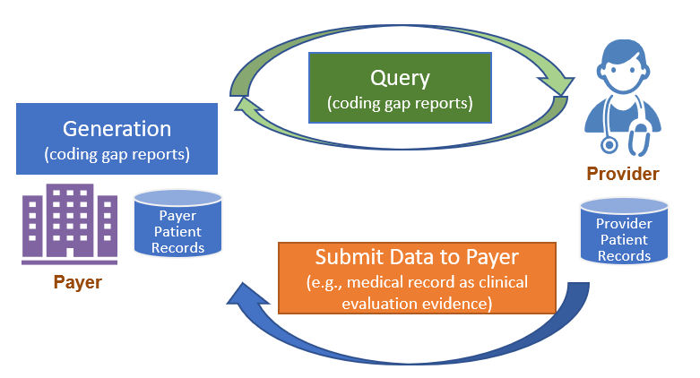
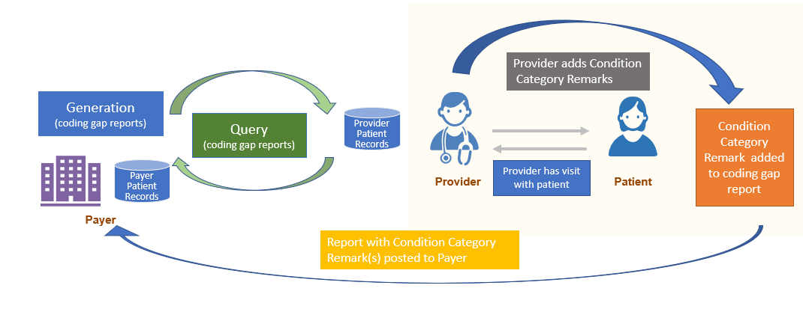

# General Guidance - Da Vinci Risk Adjustment Implementation Guide v3.0.0-ballot

## General Guidance

### Introduction

The Da Vinci Project member organizations have identified the need of standardizing how risk adjustment coding gaps are communicated between payers and providers. This implementation guide (IG) specifies standardized risk adjustment coding gap reports and provides guidance to query the coding gap reports from a Payer for one or more patients. Standardizing the reporting structure helps lessen the burden on the providers in processing the reports so they can more easily address the patients’ care needs. This standardized structure also supports the Payer sharing information that they have but the providers may not, such as data from other providers’ claims, lab results, filled prescriptions, etc.

This IG also provides mechanisms enabling the feedback loop from Provider to Payer. Providers may add a Condition Category Remark(s) to the Risk Adjustment Coding Gap Report to indicate that they took some action(s) for a specific coding gap on the report and communicates that back to the Payer. However, if the Provider identifies a coding gap that is on the report needs to be closed or invalidated based on medical record review, this feedback process is done using the [Risk Adjustment Data Exchange MeasureReport](StructureDefinition-ra-datax-measurereport.md), which allows the Provider to send the supporting clinical evaluation evidence to the Payer. This feedback loop is important for achieving the goal of improving the accuracy and completeness of risk adjustment.

### Preconditions and Assumptions

* A contract for medical services exists between the Server and the Client requesting the Risk Adjustment Coding Gap Reports.
* Risk Adjustment Coding Gap Reports are pre-generated on the Server by a backend system such as a risk adjustment engine for risk adjustment model(s).
* It is the responsibility of the Server to ensure that the data used in the report is present in a structured and retrievable form.
* The Server and the Client have agreed upon a process to identify specific patient(s) and exchange the Patient resource's logical id or the Patient Group resource's logical id.
* Although the exact mechanisms for securing these exchanges are not specified as part of this IG: 
* Exchanges are limited to mutually agreed upon (i.e., between the Server and the Client) patient lists or population.
* Security and privacy should follow [Security and Privacy](https://hl7.org/fhir/us/davinci-hrex/security.html#security-and-privacy) guidance specified in the Da Vinci Health Record Exchange (HRex) IG.
* Systems should use standard authentication and authorization approaches. The [SMART App Launch](https://hl7.org/fhir/smart-app-launch/) and [SMART backend services](https://hl7.org/fhir/uv/bulkdata/authorization.html) authentication/authorization approach are recommended models.
 

### Risk Adjustment Lifecycle and Workflow Overview

Figure 2.1-1 shows a high level overview of the risk adjustment workflow, which consists of three main phases: [Report Generation](report-generation.md), [Report Query](report-query.md), and [Submit Data to Payer](submit-data-to-payer.md). Detailed guidance for each phase is provided on a separate page under the Methodology section.

**Figure 2.1-1 Risk Adjustment Lifecycle Phases**

#### Report Generation

For a complete introduction and background to Report Generation, please visit [Report Generation Introduction and Background](report-generation.md#introduction-and-background). Report generation describes two different approaches to generate a [Risk Adjustment Coding Gap Report](StructureDefinition-ra-measurereport.md), which are referred to as Assisted and Generated in this IG.

* [Assisted](report-generation.md#the-assisted-approach): A non-FHIR approach. The Payer uses their existing processes, such as SQL, SAS, and object-oriented languages, to generate a comma-separated values (CSV) file with tuples of patient and risk adjustment data. The Payer uses a non-FHIR RESTful API to populate a [Risk Adjustment Coding Gap Report](StructureDefinition-ra-measurereport.md) based on data in the CSV file. A REST server then POSTs the generated MeasureReports to the FHIR server. A standardized CSV header that could be used by this approach is defined in this IG. This approach will not contain evaluatedResources in a MeasureReport.
* [Generated](report-generation.md#the-generated-approach): Mostly a non-FHIR approach. The Payer generates a FHIR [Risk Adjustment Coding Gap Report](StructureDefinition-ra-measurereport.md) and evaluates resources based on data from **traditional** risk adjustment coding gap reports. These **traditional** reports are generated by their existing processes using patient data and risk adjustment data produced by risk adjustment engines. A REST server then POSTs the generated MeasureReports to the FHIR server.

You will find more details on the two approaches at [Report Generation Approaches](report-generation.md#approaches-for-generating-risk-adjustment-coding-gap-report).

#### Report Query

The Client can query the [Risk Adjustment Coding Gap Report](StructureDefinition-ra-measurereport.md) once they are generated. For example, the Payer acting as the Reporting Client can query reports based on search parameters and POST them to the Provider server. See the [Report Query](report-query.md) page for details and guidance.

#### Report Condition Category Remark

Once the queried Risk Adjustment Coding Gap MeasureReports have been sent to the intended recipient, it can be filtered as defined by the EMR and their configuration options to ensure that only germane coding gaps (e.g., HCC gaps) are made available to providers. The Provider (or a software program acting on behalf of the Provider) determines whether the coding gap is currently valid, and whether the requested encounter data evidence exists to close the gap.

At that time, if the Provider wants to note the action they took regarding a Risk Adjustment coding gap, they can add that comment to the Risk Adjustment Coding Gap Report using the [Condition Category Remark](StructureDefinition-ra-ccRemark.md) extension and return it to the Payer. This process is called [Condition Category Remark](StructureDefinition-ra-ccRemark.md).

Note: The [Condition Category Remark](StructureDefinition-ra-ccRemark.md) extension is not intended to change the status of a Condition Category gap. To change the coding gap status, follow the [Submit Data to Payer](submit-data-to-payer.md) section of this guidance. Note that both a Condition Category remark and [Submit Data to Payer](submit-data-to-payer.md) can be generated at the time the Provider sees the patient if that is appropriate.

**Figure 2.1-3 Add Condition Category Remark to Coding Gap Report Overview**

#### Submit Data to Payer

To return clinical data, the Provider will use the [Risk Adjustment Data Exchange MeasureReport](StructureDefinition-ra-datax-measurereport.md) and the [$submit-data](https://hl7.org/fhir/R4/measure-operation-submit-data.html) operation to submit data to Payer. The Payer will then be able to use the provided patient data to update the data in their system that will be included on their next coding gap report generation.

See the [Submit Data to Payer](submit-data-to-payer.md) page for more details and guidance.

### Attribution

Member attribution establishes associations between providers and payers. The process of establishing and exchanging patient lists for risk adjustment coding gap reports is not in the scope of this implementation guide. One possible way of exchanging Member Attribution Lists between providers and payers is described in the [Da Vinci - Member Attribution (ATR) List](http://hl7.org/fhir/us/davinci-atr/) implementation guide.

### Must Support

Certain elements in the profiles defined in this implementation guide are marked as Must Support. This flag is used to indicate that the element plays a critical role in defining and sharing risk adjustment coding gaps, and implementations SHALL understand and process the element.

This implementation guide uses US Core profiles where appropriate, therefore, the implications of the Must Support flag for US Core profiles must also be considered.

For more information, see the definition of [Must Support](http://hl7.org/fhir/R4/conformance-rules.html#mustSupport) in the base FHIR specification.

