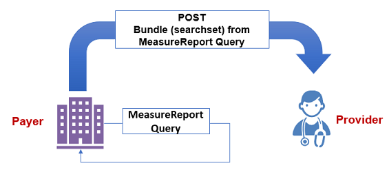
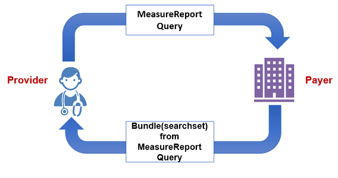
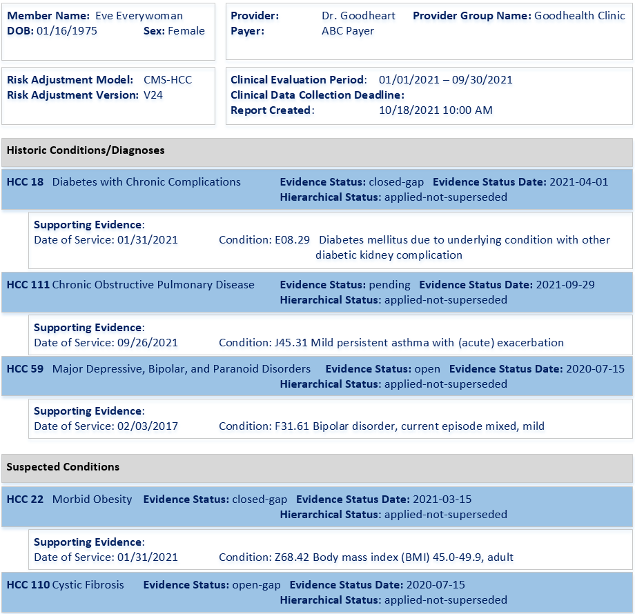
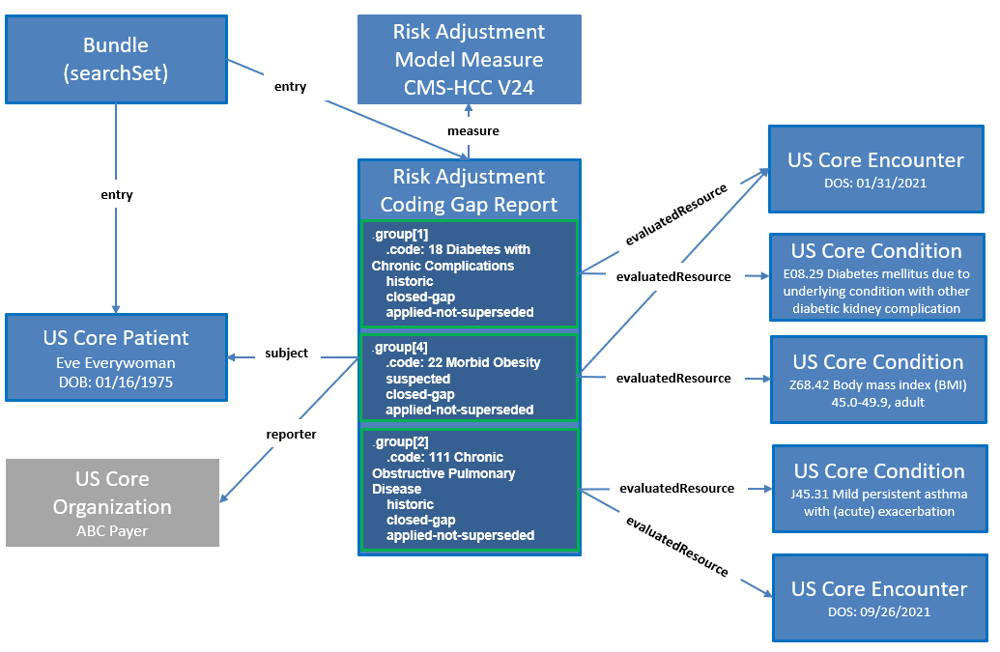

# Report Generation - Da Vinci Risk Adjustment Implementation Guide v3.0.0-ballot

## Report Generation

### Introduction and Background

During this phase of the lifecycle process, the Payer determines if there is grounds for thinking that a patient may have a risk-adjustable condition that has not yet been documented during the current clinical evaluation period. Quality measures have clear rules governing when the patient is included in/excluded from the measure denominator and numerator; not so for risk adjustment. Payers often must statistically infer the likelihood that a patient might have an undocumented Condition Category (CC). This statistical process is called Condition Category (CC) suspecting and is generally done in two ways:

* Historic conditions (also known as persisting conditions) are those which were documented during some past clinical evaluation periods, but have not yet been documented in the current period; and
* Suspected conditions, which are identified through the use of statistical modeling.

Alternatively, the Payer may receive a medical claim that confirms the presence of a previously unsuspected risk adjusted condition. Since this most often happens when a condition has been diagnosed for the first time, these are referred to as net-new conditions.

During the gap generation phase, the Payer combines all relevant data streams and determines which CC gaps exist for the patient and what their status is. An open gap is one where the Payer is soliciting information from the Provider that the patient either has the condition, or that the gap is invalid. A closed gap is one where the Payer has the necessary evidence that the gap is valid for the current clinical evaluation period. But because the CC suspecting process is probabilistic there will always be a certain percentage of invalid gaps that the Provider indicates are not clinically appropriate for the patient. Additionally, the gaps state of pending may be used when a payer receives a gap closure request and is working on confirming that closure; the pending state is discussed further in the Submit Data to Payer section.

Many risk adjustment models are constructed in such a way as to differentiate between different degrees of severity in the disease process. For example, the Medicare Advantage model v24 divides diabetes into three condition categories, which in order from least to most severe are: CC 19 (diabetes without complications); CC 18 (diabetes with chronic complications); and CC 17 (diabetes with acute complications.) During the clinical evaluation period a patient may be diagnosed with diabetes several times, with individual diagnoses rolling up to different Condition Categories (CCs). To avoid paying twice for the same underlying condition, a hierarchy is applied to the CCs so that only the most severe form is counted for risk adjustment purposes; applying these hierarchies turns a CC into a Hierarchical Condition Category (HCC). In the previous example, CC 17 supersedes CCs 18 and 19, and CC 18 supersedes CC 19.

There are many potential uses for CC gap information. For example, a provider may seek to take action on open gaps, or they may want confirmation of their previous gap closure or gap invalidation actions from the payer, or they may want to calculate their gap closure performance under the terms of a value-based payment arrangement. In general, the Payer will not know in advance which of these purposes the data will be used for, so the approach that has been taken in this implementation guide (IG) is for the Payer to provide as much CC gap data as possible, with flags on the data so that the Provider may filter the CC gaps on the receiving end. This makes it possible for the IG to support as broad a range of applications as possible. Data filtering is the responsibility of the recipient.

To summarize: the ccType of a CC gap may be historic, suspected, or net-new; its evidenceStatus may be open-gap, closed-gap, pending, or invalid; and its hierarchicalStatus may be applied-superseded, applied-not-superseded, not-applied, or not-applicable (e.g., if the model is non-hierarchical.) These three flags can be used to facilitate data filtering by the requester.

Once the CC gaps have been identified and their filtering flags are set, the next task is to put them into a FHIR MeasureReport. This IG provides two approaches to do this.

* The [Assisted](report-generation.md#the-assisted-approach) approach is intended for situations in which the Payer wants to cause minimal impact on existing risk adjustment operations. For many Payers, lists of CC gaps are produced by manual processes and/or SAS datasets. This approach provides a means for ingesting preexisting gap lists and mapping them to FHIR resource elements.
* In the [Generated](report-generation.md#the-generated-approach) approach FHIR resource inputs are consumed directly and used to generate a risk adjustment MeasureReport.

This IG includes a section describing Digital Condition Categories (dCC). As work continues on dCC's, the approach for generating reports used there may be used in parallel. For example, a payer organization might use dCCs for evaluating diabetes, heart disease, heart failure, and COPD, with all the other CCs evaluated through Risk Adjustment Coder (e.g., Certified Risk Adjustment Coder (CRC)). This means that some means must be provided for generating a single combined MeasureReport containing CC gaps from different input streams: the diabetes CC gaps might come from dCCs, while other CC gaps might come from SAS datasets or the like. In future state as dCCs become available, a MeasureReport may result from the merger of the Assisted and Generated, as well as the Evaluated data stream method used in dCC. In this way a MeasureReport will contain a holistic view of a patient’s CC gaps, no matter where those gaps originated.

Once all MeasureReports have been created, a query can be run for one or more [Risk Adjustment Coding Gap Report](StructureDefinition-ra-measurereport.md)s for a single patient or group of patients. This query can be run by either the Provider to pull the report to their system, or it can be run by the Payer and pushed/posted to the Provider’s system.

### Actors

The Actors involved in coding gap report generation are defined as the Payer and the Provider:

* The Payer acts as the Reporting Server that receives the query request for retrieving the [Risk Adjustment Coding Gap Report](StructureDefinition-ra-measurereport.md) resources.
* Either the Provider or Payer acting as the Reporting Client, can request [Risk Adjustment Coding Gap Report](StructureDefinition-ra-measurereport.md) using a FHIR query on the MeasureReport resource.

In the example shown in Figure 2.2-1, a Payer plays the role both as Reporting Server and Reporting Client in this scenario. The Payer (acting as the Reporting Client) queries the [Risk Adjustment Coding Gap Report](StructureDefinition-ra-measurereport.md) on their Reporting Server based on the search parameters provided. Then the Payer POSTs the searchset Bundle to the Provider.

**Figure 2.2-1 Report Generation Actors - Example 1**


As shown in Figure 2.2-2, the Provider playing the role of the Reporting Client queries the [Risk Adjustment Coding Gap Report](StructureDefinition-ra-measurereport.md) on the Payer's Reporting Server with search parameters. The Payer's Reporting Server returns the [Risk Adjustment Coding Gap Report](StructureDefinition-ra-measurereport.md) and the evaluated Resources to the Provider.

**Figure 2.2-2 Report Generation Actors - Example 2**


### Risk Adjustment Coding Gap MeasureReport

The [Risk Adjustment Coding Gap Report](StructureDefinition-ra-measurereport.md) is used to represent a coding gap report for a single patient and a version specific risk adjustment model. The required `MeasureReport.subject` references [US Core Patient](http://hl7.org/fhir/us/core/STU3.1.1/StructureDefinition-us-core-patient.html) and the required `MeasureReport.measure` element references the [Risk Adjustment Model Measure](StructureDefinition-ra-model-measure.md). The [Risk Adjustment Model Measure](StructureDefinition-ra-model-measure.md) profile specifies risk adjustment model information, which requires both a model identifier and a version. If the Server's risk adjustment engine runs multiple risk adjustment models including different versions of the same model, then there will be multiple [Risk Adjustment Coding Gap Report](StructureDefinition-ra-measurereport.md)s for a patient. For example, if a risk adjustment engine runs reports using CMS-HCC V25, CMS-HCC V24, and Rx-HCC V5, then there will be three separate [Risk Adjustment Coding Gap Report](StructureDefinition-ra-measurereport.md)s for the patient, each for a version specific risk adjustment model.

The [MeasureReport] resource has zero to many `group` elements. Each `group` element contains information for a Condition Category (CC), therefore, each MeasureReport may contain multiple Condition Category (CC) codes. The `group.code` is used to represent the actual code for a Condition Category (CC), such as HCC 18 (Diabetes with No Complication). The [Risk Adjustment Coding Gap Report](StructureDefinition-ra-measurereport.md) profile adds several extensions to the MeasureReport resource’s `group` element to provide additional information about a Condition Category (CC), including:

* the type for a Condition Category (CC) coding gap that is either historic, suspected, or net-new;
* the evidence status of a Condition Category (CC) coding gap that is either closed-gap, open-gap, invalid-gap or pending;
* the evidence status date indicating when the evidence status was changed to either closed-gap, open-gap, invalid-gap or pending; and
* the hierarchical status indicating whether hierarchies were applied to a Condition Category (CC), and if applied, whether the Condition Category (CC) is superseded. The status can be either applied-superseded, applied-not-superseded, not-applied, or not-applicable.

In addition, the [Risk Adjustment Coding Gap Report](StructureDefinition-ra-measurereport.md) provides the capability of sharing supporting evidence for a Condition Category (CC) through the use of the `MeasureReport.evaluatedResource` element. This supporting evidence may include resources for data such as encounters, lab results, medications, and procedures, and the `evaluatedResource` shall reference the appropriate US Core profile. The extension [ra-groupReference](StructureDefinition-ra-groupReference.md) added to the `evaluatedResource` element enables tying a specific supporting evidence to a Condition Category (CC). This is accomplished by setting the extension’s `valueString` to be the same value of the `MeasureGroup.group.id` of the Condition Category (CC) to establish the association between the supporting evidence and one or more Condition Categories.

### Example Coding Gap Report

Figure 2.2-3 is an example of how a [Risk Adjustment Coding Gap Report](StructureDefinition-ra-measurereport.md) might be displayed. The Provider queries for the [Risk Adjustment Coding Gap Report](StructureDefinition-ra-measurereport.md)s for patient Eve Everywoman (`subject`) and for a clinical evaluation period from January 1, 2021 to December 31, 2021 (`periodStart` and `periodEnd`). The Payer receives the request and finds a matching risk adjustment coding gap report for Eve Everywoman that has a clinical evaluation period of January 1, 2021 to September 30, 2021, which overlaps the `periodStart` and `periodEnd` dates provided in the query - see [Report Query](report-query.md). This report was generated on October 18th, 2021 using the risk adjustment model CMS-HCC V24. As shown in this example report, Eve Everywoman has five Hierarchical Condition Categories (HCCs). Three of the HCCs are historic diagnoses and two are suspected diagnoses. For example, one of the historic diagnoses is HCC 18 (Diabetes with no Complications). The status of this coding gap is shown as closed and the evidence status date is April 1, 2021. The supporting evidence field shows the clinical data that was used to close the coding gap HCC 18.

**Figure 2.2-3 Example Risk Adjustment Coding Gap Report**


### Resources and Profiles

The following resources and their profiles specified in this IG are used to support sharing [Risk Adjustment Coding Gap Report](StructureDefinition-ra-measurereport.md)s between the Payer and the Provider:

| | | |
| :--- | :--- | :--- |
| Group | Patient Group Profile | [Patient Group](StructureDefinition-ra-patient-group.md) |
| MeasureReport | Risk Adjustment Coding Gap MeasureReport | [Risk Adjustment Coding Gap Report](StructureDefinition-ra-measurereport.md) |
| Measure | Risk Adjustment Model Measure | [Risk Adjustment Model Measure](StructureDefinition-ra-model-measure.md) |

Figure 2.2-4 provides a graphical view of how these resources are related to the example report above for some of the Condition Categories on the report. The main resource is the [Risk Adjustment Coding Gap Report](StructureDefinition-ra-measurereport.md) profile. This coding gap report references a [Risk Adjustment Model Measure](StructureDefinition-ra-model-measure.md), which indicates CMS-HCC V24 is the risk adjustment model this report is based on. The coding gap report also references the Patient ([US Core Patient](http://hl7.org/fhir/us/core/STU3.1.1/StructureDefinition-us-core-patient.html)) as well as the Organization ([US Core Organization](http://hl7.org/fhir/us/core/STU3.1.1/StructureDefinition-us-core-organization.html)) that generated the report. The graph shows three groups within a [Risk Adjustment Coding Gap Report](StructureDefinition-ra-measurereport.md) using three example HCCs from Figure 2.2-3 to illustrate how each `group` corresponds to an HCC including its attributes. Note that the Bundle in this graph is a searchset Bundle returned by FHIR query with the Risk Adjustment Coding Gap Reports.

**Figure 2.2-4 Resource Graph for Risk Adjustment Coding Gap Report**


### Approaches for Generating Risk Adjustment Coding Gap Report

This IG describes two approaches to generate a [Risk Adjustment Coding Gap Report](StructureDefinition-ra-measurereport.md). The approaches provide an adoption strategy that allows consumers of this IG to choose an implementation that matches their current state of FHIR maturity, including an option for generating a [Risk Adjustment Coding Gap Report](StructureDefinition-ra-measurereport.md) that requires little to no FHIR maturity and then transition to more mature approaches as their FHIR maturity grows. As mentioned above, the Payer can use one or more of these processes as fits their need or stage as they transition their processes.

#### The Assisted Approach

This approach requires little to no FHIR maturity to generate the [Risk Adjustment Coding Gap Report](StructureDefinition-ra-measurereport.md). The Payer uses their existing processes, such as SQL, SAS, and object-oriented languages, to create a comma-separated value (CSV) file with tuples of patient and risk adjustment data. The Payer then uses a non-FHIR RESTful API to create the [Risk Adjustment Coding Gap Report](StructureDefinition-ra-measurereport.md) using the CSV file as input. Note that using this approach means that no evaluated resources will be created or referenced by the [Risk Adjustment Coding Gap Report](StructureDefinition-ra-measurereport.md).

The table below defines a standardized CSV header that could be used for the Assisted approach.

| | | | |
| :--- | :--- | :--- | :--- |
| periodStart | Start of the clinical evaluation period | `MeasureReport.period.start` | 1/1/2021 |
| periodEnd | End of clinical evaluation period | `MeasureReport.period.end` | 9/30/2021 |
| modelId | Risk adjustment model identifier | `Measure.identifier`(MeasureReport.measure) | https://build.fhir.org/ig/HL7/davinci-ra/Measure-RAModelExample01 |
| modelVersion | Risk adjustment model version | `Measure.version`(MeasureReport.measure) | 24 |
| patientId | Patient identifier | `Patient.identifier`(MeasureReport.subject) | ra-patient01 |
| ccCode | Condition Category Code | `MeasureGroup.group.code` | 18 |
| suspectType | Coding gap suspect type | `MeasureReport.group.suspectType` | historic |
| evidenceStatus | Coding gap evidence status | `MeasureReport.group.evidenceStatus` | open-gap |
| evidenceStatusDate | Coding gap evidence status date | `MeasureReport.group.evidenceStatusDate` | 4/1/2021 |
| hierarchicalStatus | Coding gap hierarchical status | `MeasureReport.group.hierarchicalStatus` | applied-not-superseded |

 Click Here To See Example Assisted CSV 

#### Examples

**Scenario:**

The Payer has used their existing processes to collect risk adjustment data and would to use the Assisted Approach to generate a Risk Adjustment Coding Gap Report.

**POST risk adjustment CSV data to REST endpoint**

```
POST [base]

```

**Request body**

```
periodStart,periodEnd,modelId,modelVersion,patientId,ccCode,suspectType,evidenceStatus,evidenceStatusDate,hierarchicalStatus
2021-01-01,2021-09-30,https://build.fhir.org/ig/HL7/davinci-ra/Measure-RAModelExample01,24,ra-patient01,18,historic,closed-gap,2021-04-01,applied-not-superseded
2021-01-01,2021-09-30,https://build.fhir.org/ig/HL7/davinci-ra/Measure-RAModelExample01,24,ra-patient01,111,historic,pending,2021-09-29,applied-not-superseded
2021-01-01,2021-09-30,https://build.fhir.org/ig/HL7/davinci-ra/Measure-RAModelExample01,24,ra-patient01,24,historic,open-gap,2020-07-15,applied-not-superseded
2021-01-01,2021-09-30,https://build.fhir.org/ig/HL7/davinci-ra/Measure-RAModelExample01,24,ra-patient01,112,historic,closed-gap,2021-04-27,applied-superseded
2021-01-01,2021-09-30,https://build.fhir.org/ig/HL7/davinci-ra/Measure-RAModelExample01,24,ra-patient01,19,historic,pending,2021-09-27,applied-superseded
2021-01-01,2021-09-30,https://build.fhir.org/ig/HL7/davinci-ra/Measure-RAModelExample01,24,ra-patient01,84,historic,open-gap,2020-12-15,applied-superseded
2021-01-01,2021-09-30,https://build.fhir.org/ig/HL7/davinci-ra/Measure-RAModelExample01,24,ra-patient01,22,suspected,closed-gap,2021-03-15,applied-not-superseded
2021-01-01,2021-09-30,https://build.fhir.org/ig/HL7/davinci-ra/Measure-RAModelExample01,24,ra-patient01,96,suspected,pending,2021-09-27,applied-not-superseded
2021-01-01,2021-09-30,https://build.fhir.org/ig/HL7/davinci-ra/Measure-RAModelExample01,24,ra-patient01,110,suspected,open-gap,2020-07-15,applied-not-superseded
2021-01-01,2021-09-30,https://build.fhir.org/ig/HL7/davinci-ra/Measure-RAModelExample01,24,ra-patient01,83,net-new,pending,2021-09-28,applied-not-superseded
2021-01-01,2021-09-30,https://build.fhir.org/ig/HL7/davinci-ra/Measure-RAModelExample01,24,ra-patient01,59,historic,open-gap,2020-07-15,applied-not-superseded

```

**Response**

```
{
  "resourceType": "Bundle",
  "type": "transaction",
  "entry": [
    {
      "resource": {
        "resourceType": "MeasureReport",
        "id": "assisted-5534e962-4493-4be7-9499-aeadc962f641",
        "meta": {
          "profile": [
            "https://build.fhir.org/ig/HL7/davinci-ra/StructureDefinition-ra-measurereport.html"
          ]
        },
        "status": "complete",
        "type": "individual",
        "measure": "https://build.fhir.org/ig/HL7/davinci-ra/Measure-RAModelExample01",
        "subject": {
          "reference": "Patient/ra-patient01"
        },
        "date": "2023-03-10T18:31:14+00:00",
        "period": {
          "start": "2021-01-01T00:00:00+00:00",
          "end": "2021-09-30T00:00:00+00:00"
        },
        "group": [
          {
            "id": "group-18",
            "extension": [
              {
                "url": "http://hl7.org/fhir/us/davinci-ra/StructureDefinition/ra-suspectType",
                "valueCodeableConcept": {
                  "coding": [
                    {
                      "system": "http://hl7.org/fhir/us/davinci-ra/CodeSystem/suspect-type",
                      "code": "historic"
                    }
                  ]
                }
              },
              {
                "url": "http://hl7.org/fhir/us/davinci-ra/StructureDefinition/ra-evidenceStatus",
                "valueCodeableConcept": {
                  "coding": [
                    {
                      "system": "http://hl7.org/fhir/us/davinci-ra/CodeSystem/evidence-status",
                      "code": "closed-gap"
                    }
                  ]
                }
              },
              {
                "url": "http://hl7.org/fhir/us/davinci-ra/StructureDefinition/ra-evidenceStatusDate",
                "valueDate": "2021-04-01"
              }
            ],
            "code": {
              "coding": [
                {
                  "system": "http://terminology.hl7.org/CodeSystem/cmshcc",
                  "version": "24",
                  "code": "18"
                }
              ]
            }
          },
          {
            "id": "group-111",
            "extension": [
              {
                "url": "http://hl7.org/fhir/us/davinci-ra/StructureDefinition/ra-suspectType",
                "valueCodeableConcept": {
                  "coding": [
                    {
                      "system": "http://hl7.org/fhir/us/davinci-ra/CodeSystem/suspect-type",
                      "code": "historic"
                    }
                  ]
                }
              },
              {
                "url": "http://hl7.org/fhir/us/davinci-ra/StructureDefinition/ra-evidenceStatus",
                "valueCodeableConcept": {
                  "coding": [
                    {
                      "system": "http://hl7.org/fhir/us/davinci-ra/CodeSystem/evidence-status",
                      "code": "pending"
                    }
                  ]
                }
              },
              {
                "url": "http://hl7.org/fhir/us/davinci-ra/StructureDefinition/ra-evidenceStatusDate",
                "valueDate": "2021-09-29"
              }
            ],
            "code": {
              "coding": [
                {
                  "system": "http://terminology.hl7.org/CodeSystem/cmshcc",
                  "version": "24",
                  "code": "111"
                }
              ]
            }
          },
          {
            "id": "group-24",
            "extension": [
              {
                "url": "http://hl7.org/fhir/us/davinci-ra/StructureDefinition/ra-suspectType",
                "valueCodeableConcept": {
                  "coding": [
                    {
                      "system": "http://hl7.org/fhir/us/davinci-ra/CodeSystem/suspect-type",
                      "code": "historic"
                    }
                  ]
                }
              },
              {
                "url": "http://hl7.org/fhir/us/davinci-ra/StructureDefinition/ra-evidenceStatus",
                "valueCodeableConcept": {
                  "coding": [
                    {
                      "system": "http://hl7.org/fhir/us/davinci-ra/CodeSystem/evidence-status",
                      "code": "open-gap"
                    }
                  ]
                }
              },
              {
                "url": "http://hl7.org/fhir/us/davinci-ra/StructureDefinition/ra-evidenceStatusDate",
                "valueDate": "2020-07-15"
              }
            ],
            "code": {
              "coding": [
                {
                  "system": "http://terminology.hl7.org/CodeSystem/cmshcc",
                  "version": "24",
                  "code": "24"
                }
              ]
            }
          },
          {
            "id": "group-112",
            "extension": [
              {
                "url": "http://hl7.org/fhir/us/davinci-ra/StructureDefinition/ra-suspectType",
                "valueCodeableConcept": {
                  "coding": [
                    {
                      "system": "http://hl7.org/fhir/us/davinci-ra/CodeSystem/suspect-type",
                      "code": "historic"
                    }
                  ]
                }
              },
              {
                "url": "http://hl7.org/fhir/us/davinci-ra/StructureDefinition/ra-evidenceStatus",
                "valueCodeableConcept": {
                  "coding": [
                    {
                      "system": "http://hl7.org/fhir/us/davinci-ra/CodeSystem/evidence-status",
                      "code": "closed-gap"
                    }
                  ]
                }
              },
              {
                "url": "http://hl7.org/fhir/us/davinci-ra/StructureDefinition/ra-evidenceStatusDate",
                "valueDate": "2021-04-27"
              }
            ],
            "code": {
              "coding": [
                {
                  "system": "http://terminology.hl7.org/CodeSystem/cmshcc",
                  "version": "24",
                  "code": "112"
                }
              ]
            }
          },
          {
            "id": "group-19",
            "extension": [
              {
                "url": "http://hl7.org/fhir/us/davinci-ra/StructureDefinition/ra-suspectType",
                "valueCodeableConcept": {
                  "coding": [
                    {
                      "system": "http://hl7.org/fhir/us/davinci-ra/CodeSystem/suspect-type",
                      "code": "historic"
                    }
                  ]
                }
              },
              {
                "url": "http://hl7.org/fhir/us/davinci-ra/StructureDefinition/ra-evidenceStatus",
                "valueCodeableConcept": {
                  "coding": [
                    {
                      "system": "http://hl7.org/fhir/us/davinci-ra/CodeSystem/evidence-status",
                      "code": "pending"
                    }
                  ]
                }
              },
              {
                "url": "http://hl7.org/fhir/us/davinci-ra/StructureDefinition/ra-evidenceStatusDate",
                "valueDate": "2021-09-27"
              }
            ],
            "code": {
              "coding": [
                {
                  "system": "http://terminology.hl7.org/CodeSystem/cmshcc",
                  "version": "24",
                  "code": "19"
                }
              ]
            }
          },
          {
            "id": "group-84",
            "extension": [
              {
                "url": "http://hl7.org/fhir/us/davinci-ra/StructureDefinition/ra-suspectType",
                "valueCodeableConcept": {
                  "coding": [
                    {
                      "system": "http://hl7.org/fhir/us/davinci-ra/CodeSystem/suspect-type",
                      "code": "historic"
                    }
                  ]
                }
              },
              {
                "url": "http://hl7.org/fhir/us/davinci-ra/StructureDefinition/ra-evidenceStatus",
                "valueCodeableConcept": {
                  "coding": [
                    {
                      "system": "http://hl7.org/fhir/us/davinci-ra/CodeSystem/evidence-status",
                      "code": "open-gap"
                    }
                  ]
                }
              },
              {
                "url": "http://hl7.org/fhir/us/davinci-ra/StructureDefinition/ra-evidenceStatusDate",
                "valueDate": "2020-12-15"
              }
            ],
            "code": {
              "coding": [
                {
                  "system": "http://terminology.hl7.org/CodeSystem/cmshcc",
                  "version": "24",
                  "code": "84"
                }
              ]
            }
          },
          {
            "id": "group-22",
            "extension": [
              {
                "url": "http://hl7.org/fhir/us/davinci-ra/StructureDefinition/ra-suspectType",
                "valueCodeableConcept": {
                  "coding": [
                    {
                      "system": "http://hl7.org/fhir/us/davinci-ra/CodeSystem/suspect-type",
                      "code": "suspected"
                    }
                  ]
                }
              },
              {
                "url": "http://hl7.org/fhir/us/davinci-ra/StructureDefinition/ra-evidenceStatus",
                "valueCodeableConcept": {
                  "coding": [
                    {
                      "system": "http://hl7.org/fhir/us/davinci-ra/CodeSystem/evidence-status",
                      "code": "closed-gap"
                    }
                  ]
                }
              },
              {
                "url": "http://hl7.org/fhir/us/davinci-ra/StructureDefinition/ra-evidenceStatusDate",
                "valueDate": "2021-03-15"
              }
            ],
            "code": {
              "coding": [
                {
                  "system": "http://terminology.hl7.org/CodeSystem/cmshcc",
                  "version": "24",
                  "code": "22"
                }
              ]
            }
          },
          {
            "id": "group-96",
            "extension": [
              {
                "url": "http://hl7.org/fhir/us/davinci-ra/StructureDefinition/ra-suspectType",
                "valueCodeableConcept": {
                  "coding": [
                    {
                      "system": "http://hl7.org/fhir/us/davinci-ra/CodeSystem/suspect-type",
                      "code": "suspected"
                    }
                  ]
                }
              },
              {
                "url": "http://hl7.org/fhir/us/davinci-ra/StructureDefinition/ra-evidenceStatus",
                "valueCodeableConcept": {
                  "coding": [
                    {
                      "system": "http://hl7.org/fhir/us/davinci-ra/CodeSystem/evidence-status",
                      "code": "pending"
                    }
                  ]
                }
              },
              {
                "url": "http://hl7.org/fhir/us/davinci-ra/StructureDefinition/ra-evidenceStatusDate",
                "valueDate": "2021-09-27"
              }
            ],
            "code": {
              "coding": [
                {
                  "system": "http://terminology.hl7.org/CodeSystem/cmshcc",
                  "version": "24",
                  "code": "96"
                }
              ]
            }
          },
          {
            "id": "group-110",
            "extension": [
              {
                "url": "http://hl7.org/fhir/us/davinci-ra/StructureDefinition/ra-suspectType",
                "valueCodeableConcept": {
                  "coding": [
                    {
                      "system": "http://hl7.org/fhir/us/davinci-ra/CodeSystem/suspect-type",
                      "code": "suspected"
                    }
                  ]
                }
              },
              {
                "url": "http://hl7.org/fhir/us/davinci-ra/StructureDefinition/ra-evidenceStatus",
                "valueCodeableConcept": {
                  "coding": [
                    {
                      "system": "http://hl7.org/fhir/us/davinci-ra/CodeSystem/evidence-status",
                      "code": "open-gap"
                    }
                  ]
                }
              },
              {
                "url": "http://hl7.org/fhir/us/davinci-ra/StructureDefinition/ra-evidenceStatusDate",
                "valueDate": "2020-07-15"
              }
            ],
            "code": {
              "coding": [
                {
                  "system": "http://terminology.hl7.org/CodeSystem/cmshcc",
                  "version": "24",
                  "code": "110"
                }
              ]
            }
          },
          {
            "id": "group-83",
            "extension": [
              {
                "url": "http://hl7.org/fhir/us/davinci-ra/StructureDefinition/ra-suspectType",
                "valueCodeableConcept": {
                  "coding": [
                    {
                      "system": "http://hl7.org/fhir/us/davinci-ra/CodeSystem/suspect-type",
                      "code": "net-new"
                    }
                  ]
                }
              },
              {
                "url": "http://hl7.org/fhir/us/davinci-ra/StructureDefinition/ra-evidenceStatus",
                "valueCodeableConcept": {
                  "coding": [
                    {
                      "system": "http://hl7.org/fhir/us/davinci-ra/CodeSystem/evidence-status",
                      "code": "pending"
                    }
                  ]
                }
              },
              {
                "url": "http://hl7.org/fhir/us/davinci-ra/StructureDefinition/ra-evidenceStatusDate",
                "valueDate": "2021-09-28"
              }
            ],
            "code": {
              "coding": [
                {
                  "system": "http://terminology.hl7.org/CodeSystem/cmshcc",
                  "version": "24",
                  "code": "83"
                }
              ]
            }
          },
          {
            "id": "group-59",
            "extension": [
              {
                "url": "http://hl7.org/fhir/us/davinci-ra/StructureDefinition/ra-suspectType",
                "valueCodeableConcept": {
                  "coding": [
                    {
                      "system": "http://hl7.org/fhir/us/davinci-ra/CodeSystem/suspect-type",
                      "code": "historic"
                    }
                  ]
                }
              },
              {
                "url": "http://hl7.org/fhir/us/davinci-ra/StructureDefinition/ra-evidenceStatus",
                "valueCodeableConcept": {
                  "coding": [
                    {
                      "system": "http://hl7.org/fhir/us/davinci-ra/CodeSystem/evidence-status",
                      "code": "open-gap"
                    }
                  ]
                }
              },
              {
                "url": "http://hl7.org/fhir/us/davinci-ra/StructureDefinition/ra-evidenceStatusDate",
                "valueDate": "2020-07-15"
              }
            ],
            "code": {
              "coding": [
                {
                  "system": "http://terminology.hl7.org/CodeSystem/cmshcc",
                  "version": "24",
                  "code": "59"
                }
              ]
            }
          }
        ]
      },
      "request": {
        "method": "PUT",
        "url": "MeasureReport/assisted-5534e962-4493-4be7-9499-aeadc962f641"
      }
    }
  ]
}

```

#### The Generated Approach

This approach requires an implementation that adheres to the requirements of this IG to generate the [Risk Adjustment Coding Gap Report](StructureDefinition-ra-measurereport.md). The Payer constructs the FHIR [Risk Adjustment Coding Gap Report](StructureDefinition-ra-measurereport.md) and the evaluated resources based on data from **traditional** risk adjustment coding gap reports. These **traditional** reports are created by their existing processes using patient and risk adjustment data produced by risk adjustment engines.

### Usage

#### Request Risk Adjustment Coding Gap MeasureReport

`GET [base]/MeasureReport/?subject=Patient/ra-patient02&period=ge2021-01-01&period=le2021-12-31&measurereport-category="ra"&_include=MeasureReport:evaluated-resource`

 Click Here to See Example GET Risk Adjustment Coding Gap Report 

#### Examples

**Scenario:**

A provider requested a risk adjustment coding gap report for patient, **ra-patient01**, to see if the patient has any risk adjustment coding gaps for the clinical evaluation period from 2021-01-01 to 2021-09-30.

**GET Risk Adjustment Coding Gaps Report**

```
GET [base]/MeasureReport/?subject=Patient/ra-patient01&period=ge2021-01-01&period=le2021-09-30&_profile=http://hl7.org/fhir/us/davinci-ra/StructureDefinition/ra-measurereport&_include=MeasureReport:evaluated-resource

```

**Request body**

```
(Note that request body is not applicable in this example)

```

**Response**

```
HTTP/1.1 200
Date: Tues, 16 November 2021 01:02:06 GMT
Content-Type: application/fhir+json;charset=UTF-8
...Other Headers...

{
  "resourceType" : "Bundle",
  "id" : "ra-bundle02",
  "meta": {
       "lastUpdated": "2021-11-16T01:02:06"
  },
  "identifier" : {
    "system" : "urn:ietf:rfc:3986",
    "value" : "urn:uuid:af2e880f-3992-4cae-8f0d-aaf3a5c49c9e"
  },
  "type" : "searchset",
  "entry" : [
    {
      "fullUrl" : "https://ra.davinci.hl7.org/fhir/MeasureReport/ra-measurereport01",
      "resource" : {
        "resourceType" : "MeasureReport",
        "id" : "ra-measurereport01",
        "meta" : {
          "profile" : [
            "http://hl7.org/fhir/us/davinci-ra/StructureDefinition/ra-measurereport"
          ]
        },
        "status" : "complete",
  "type" : "individual",
  "measure" : "https://build.fhir.org/ig/HL7/davinci-ra/Measure-RAModelExample01",
  "subject" : {
    "reference" : "Patient/ra-patient01"
  },
  "date" : "2021-10-18",
  "reporter" : {
    "reference" : "Organization/ra-payer01"
  },
  "period" : {
    "start" : "2021-01-01",
    "end" : "2021-09-30"
  },
  "group" : [
    {
      "id" : "group-001",
      "extension" : [
        {
          "url" : "http://hl7.org/fhir/us/davinci-ra/StructureDefinition/ra-suspectType",
          "valueCodeableConcept" : {
            "coding" : [
              {
                "system" : "http://hl7.org/fhir/us/davinci-ra/CodeSystem/suspect-type",
                "code" : "historic"
              }
            ]
          }
        },

      ...

}


```

#### Bulk Data Request for Risk Adjustment Coding Gap MeasureReports

If requesting [Risk Adjustment Coding Gap Report](StructureDefinition-ra-measurereport.md) for many patients, the Reporting Client may consider using the FHIR [Asynchronous Request Patterns](https://www.hl7.org/fhir/async.html) for the Bulk Data exchange operation.

`GET [base]/MeasureReport/?subject=Group/ra-group123&period=ge2021-01-01&period=le2021-12-31&measurereport-category="ra"&_include=MeasureReport:evaluated-resource`

 Click Here to See Example GET Risk Adjustment Coding Gap Report Using Bulk Data 

#### Examples

**Scenario:**

The Client would like to request risk adjustment coding gap reports on many patients. They have created a FHIR Group resource using the Risk Adjustment [Patient Group](StructureDefinition-ra-patient-group.md) profile with the id of ra-group123. Because they expect the creation of the reports to take a while and many FHIR bundles will be returned and be processed, they would like to make the request in an asynchronous manner returning NDJSON that will be easier for them to process.

The request below asks for Group id of ra-group123 to be run asynchronously with FHIR+ndjson as the output format. The header portions should be entered in the API client header section. For example, in the [Postman](https://www.postman.com/) tool, enter “Prefer” in Key and “respond-async” in Value as an entry in the Headers tab.

**GET Risk Adjustment Coding Gap Report Using Bulk Data**

Run $report operation in an asynchronous mode:

```
GET [base]/MeasureReport/?subject=Group/ra-group123&period=ge2021-01-01&period=le2021-12-31&_profile=http://hl7.org/fhir/us/davinci-ra/StructureDefinition/ra-measurereport&_include=MeasureReport:evaluated-resource


```

Headers:

* `Prefer respond-async`
* `Accept application/fhir+json`

Note that both Prefer and Accept are required. **Prefer** specifies the response is immediate or asynchronous, which SHALL be set to **respond-async**. **Accept** specifies the format of the optional OperationOutcome response to the kick-off request. Any of the Serialization Format Representations are supported. See the base FHIR specification [Asynchronous Request Patterns](https://www.hl7.org/fhir/async.html) for details.

Query Parameters:

* `_outputFormat (string, optional, defaults to application/fhir+ndjson)`

Currently, only **application/fhir+ndjson** is supported.

#### Post Risk Adjustment Coding Gap Report

`POST [base]/Bundle`

 Click Here to See Example POST Risk Adjustment Coding Gap Report 

#### Examples

**Scenario:**

A payer posts a risk adjustment coding gap report for patient, **ra-patient01**, to let the provider know if the patient has any risk adjustment coding gaps for the clinical evaluation period from 2021-01-01 to 2021-09-30.

**POST Risk Adjustment Coding Gaps Report**

```
POST [base]/Bundle/ra-bundle01

```

**Request body**

```
{
    "resourceType": "Bundle",
    "id": "ra-bundle01",
    "meta": {
        "profile": [
            "http://hl7.org/fhir/us/davinci-ra/StructureDefinition/ra-measurereport-bundle"
        ]
    },
    "identifier": {
        "system": "urn:ietf:rfc:3986",
        "value": "urn:uuid:8d3e72d9-9d74-4cbb-b797-a1cab0d13492"
    },
    "type": "collection",
    "timestamp": "2021-11-16T06:17:58.172+00:00",
    "entry": [
        {
            "fullUrl": "https://ra.davinci.hl7.org/fhir/MeasureReport/ra-measurereport01",
            "resource": {
                "resourceType": "MeasureReport",
                "id": "ra-measurereport01",
                "meta": {
                    "profile": [
                        "http://hl7.org/fhir/us/davinci-ra/StructureDefinition/ra-measurereport"
                    ]
                },
                ...

```

**Response**

```
HTTP/1.1 200 ok

```

